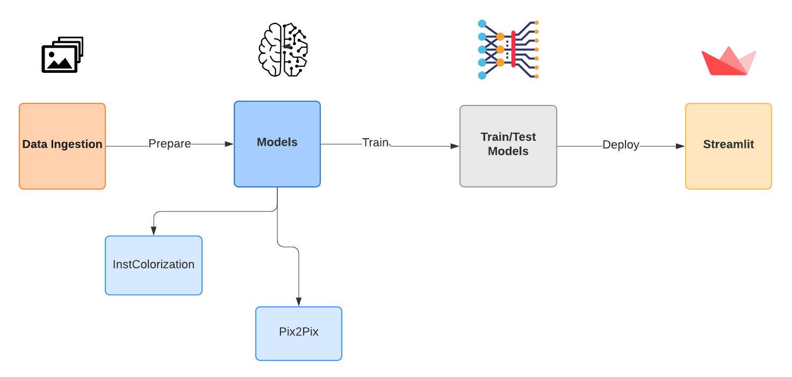

<h2 align="center">
<p>  NihonBW 🇯🇵 </p>
</h2>
<h2 align="center">
<p></p>


<p></p>
</h2>

## 📜 Abstract 

This work focuses on seeing a comparison between ancient and modern approaches to coloring the image where I chose two models which were Pix2Pix and Instance aware Colorization, where a notable difference was found in the coloring of their images.

* keywords:
 generative adversarial network , deep learning , instance , pix2pix , colorization , gray scale images

The paper is available at this here.

##  Pipeline

<p align="center">



<p align="center"></p>

</p align="center">

## 🆕 Update

- 27/02/2021 :

- We already have the first version of our work available here.

 - The Streamlit is almost finished ,the [Pix2Pix](https://github.com/junyanz/pytorch-CycleGAN-and-pix2pix) model is     loaded and ready to test and the [InstColorization](https://github.com/ericsujw/InstColorization) model is loaded and ready to test.

- Second version in process.

## 📖 Content
The following tree shows the structure of the application:
```
| -master-NihonBW/
|   |-BW/
|       |-Images/
|       |-Result/
|   |-RC/
|       |-Images/
|   |-env/..
|   |-test_pix2pix/..
|   |-imgs/..
|   |-InstColorization/..
|   |-pytorchpix2pix/..
|         |-data/..
|         |-datasets/..
|         |-imgs/..
|         |-options/..
|         |colorization/..
|         |-models/..
|         |..   
|   |-Main.py
|   |-.gitignore
|   |-README.md
|   |-requeriment.txt
```
## Prerequisites

* Linux
* Python 3
* GPU + CUDA CuDNN

## Getting Started

## Installation
1. Install the envariment
 ```
 pip install virtualenv
 ```
2. Install all dependencies with the command
 ```
 pip install -r requirements.txt.
 ```

3. Clone this repo:
 ```
git clone https://github.com/alexliqu09/NihonBW.git
 ```
## Train models

## Pix2Pix
1. If you want to train the model in local , first you need clone the original repository [Pix2Pix](https://github.com/junyanz/pytorch-CycleGAN-and-pix2pix).
2. Now you should create a dir  in  ```pytorch-CycleGAN-and-pix2pix / datasets / ``` with the name colorization and inside of this dir you create train dir , now  in train dir put your color images of trains . 
3. Finally , you only follow the script of Pix2Pix repository and use the follow command  
```
python train.py --dataroot ./datasets/colorization --name color_pix2pix --model colorization 
```
4. Search the dir checkpoints/color_pix2pix the weigth  ```latest_net_G.pth ```.

5. Now in the dir ```/NihongoBW/pytorchpix2pix/checkpoints/ ``` create the dir ```experiment_name``` and  you need to move the  ```latest_net_G.pth ``` in the dir ```/NihongoBW/pytorchpix2pix/checkpoints/experiment_name/```.

* Note: If you want to train the model in colab , I used is available [here](https://colab.research.google.com/github/alexliqu09/NihonBW/blob/main/Notebook_colabs/Pix2Pix/NihonBw_Pix2Pix_Train.ipynb).
* Note: The dataset used me is available [here](https://drive.google.com/drive/folders/1h92vKaWDMGzolhSv0mOF8-J_OkVznQBw?usp=sharing)

## InstColorization
1. If you want to train the model in local , first you need clone the original repository [InstColorization](https://github.com/ericsujw/InstColorization).
2. Now you should create a dir  in  ```InstColorization/train_dataset/ ``` with the name colorization and inside of this dir you create train dir , now  in train dir put your color images of trains . 
3. Finally , you only follow the script of InstColorization repository and use the follow command  
```
#Prepare the data

python inference_bbox.py --test_img_dir ./train_dataset/train --filter_no_obj

#First Module

mkdir ./checkpoints/coco_full

cp ./checkpoints/siggraph_retrained/latest_net_G.pth ./checkpoints/coco_full/

python train.py --stage full --name coco_full --sample_p 1.0 --niter 100 --niter_decay 50 --load_model --lr 0.0005 --model train --fineSize 256 --batch_size 16 --display_ncols 3 --display_freq 1600 --print_freq 1600 --train_img_dir      ./train_dataset/train 

#Second Module

mkdir ./checkpoints/coco_instance
cp ./checkpoints/coco_full/latest_net_G.pth ./checkpoints/coco_instance/
python train.py --stage instance --name coco_instance --sample_p 1.0 --niter 100 --niter_decay 50 --load_model --lr 0.0005 --model train --fineSize 256 --batch_size 16 --display_ncols 3 --display_freq 1600 --print_freq 1600 --train_img_dir ./train_dataset/train 

#Third Module

mkdir ./checkpoints/coco_mask
cp ./checkpoints/coco_full/latest_net_G.pth ./checkpoints/coco_mask/latest_net_GF.pth
cp ./checkpoints/coco_instance/latest_net_G.pth ./checkpoints/coco_mask/latest_net_G.pth
cp ./checkpoints/coco_full/latest_net_G.pth ./checkpoints/coco_mask/latest_net_GComp.pth
python train.py --stage fusion --name coco_mask --sample_p 1.0 --niter 10 --niter_decay 20 --lr 0.00005 --model train --load_model --display_ncols 4 --fineSize 256 --batch_size 1 --display_freq 500 --print_freq 500 --train_img_dir          ./train_dataset/train 

```
4. Search the dir ```NihonBW/InstColorization/checkpoints/``` the weigth move and change the dir ```checkpoints/``` for the ```checkpoints/``` where you trained.

* Note: If you want to train the model in colab , I used is available [here](https://colab.research.google.com/github/alexliqu09/NihonBW/blob/main/Notebook_colabs/InstColorization/InstanceColorization.ipynb).

## Run the work
If You want to proof the work , you need mov to dirs and position yourself with ```NihonBW/``` and run this command
```
streamlit run main.py
```
* Note: 
```
Local host : http://localhost:8501 
Network URL:  http://192.168.0.5:8501
```
below a demonstration of this work.
<p align="center">


<p align="center">"NihonBW"</p>

</p align="center">

## 👨🏽‍💻 Maintainer
* Alexander Leonardo Lique Lamas, Github: [alexliqu09](https://github.com/alexliqu09) Email: alexander.lique.l@uni.pe

## 🙏🏽 Special thanks

* Many thanks to the repository of [junyanz](https://github.com/junyanz) author of [Pix2Pix](https://github.com/junyanz/pytorch-CycleGAN-and-pix2pix),this work would not have been possible without your repository.
* Many thanks to the repository of [ericsujw](https://github.com/ericsujw) author of [InstColorization](https://github.com/ericsujw/InstColorization),this work would not have been possible without your repository.

## Citation
If you want to cite this code for your research , please cite my paper:
```
 @article{lique , 
 title={Coloring Black and White Images}, 
 author={Lique Lamas, Alexander Leonardo},
 year={2021}} 
```
If you find InstColorization useful , please cite this paper:
```
@inproceedings{Su-CVPR-2020,
  author = {Su, Jheng-Wei and Chu, Hung-Kuo and Huang, Jia-Bin},
  title = {Instance-aware Image Colorization},
  booktitle = {IEEE Conference on Computer Vision and Pattern Recognition (CVPR)},
  year = {2020}
}
```
If you find Pix2Pix useful , please cite this paper:
```
@inproceedings{isola2017image,
  title={Image-to-Image Translation with Conditional Adversarial Networks},
  author={Isola, Phillip and Zhu, Jun-Yan and Zhou, Tinghui and Efros, Alexei A},
  booktitle={Computer Vision and Pattern Recognition (CVPR), 2017 IEEE Conference on},
  year={2017}
}
```